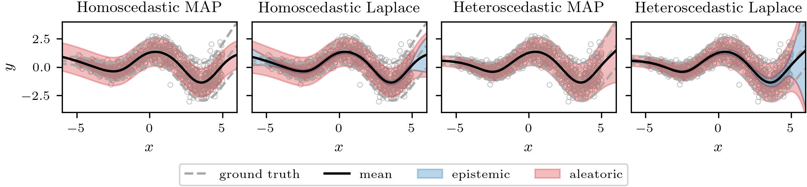
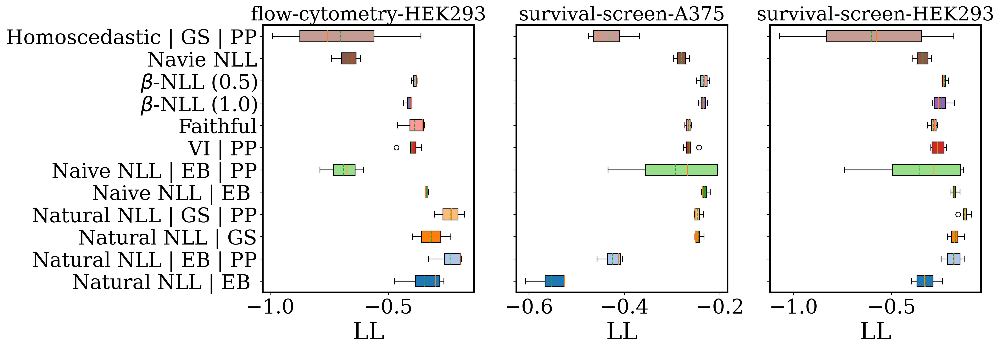

<!--  -->

# Towards validation and exploration of an effective bayesian heteroscedastic regression

This repository contains the reimplemented code for the paper "Effective Bayesian Heteroscedastic Regression with Deep Neural Networks" published at NeurIPS 2023.
The PDF is available [here](https://openreview.net/pdf?id=A6EquH0enk).

## Setup
### Requirement
For experiments, we used `python>=3.9` and `torch==1.12.1`.
Additional online dependencies are listed in `requirements.txt` and have to be installed with `pip install -r requirements.txt`.
### Modified packages
`dependencies/` contain modified versions of [`laplace-torch`](https://github.com/aleximmer/Laplace) and [`asdl`](https://github.com/kazukiosawa/asdl) and have to be installed with `pip install -e dependencies/laplace` and `pip install -e dependencies/asdl`.
To install local utilities, run `pip install -e .` in the root directory of this repository.

## Example Usage
### Get started
A simple example using an MLP on the *Skafte* data set can be found in `plot_skafte_example.py`. It reproduces the illustration in the readme. 

        python plot_skafte_example.py 

### Experiments on database
Image (Mnist, Fashion-Mnist and CiFAR-10), UCI, and CRISPR regression commands can be generated, which also serve as examples for running our method.
The [`./01-job-scripts`](./01-job-scripts/) contains the job scripts for the experiments using all the aforementioned cases. For example, to run the cases on UCI database: 

        python 01-job-scripts/jobs_uci_generate.py 

which will use the configuration and execute the `run_uci_crispr_regression.py`. And the general configurations can be found in [`./configs`](./configs/)

Note that all the data will be available in the [Weight and Bias (W&B)](https://wandb.ai/home) project. One can easily get access to massive cases online and manage the data. 

### Post Processing 
All the resulting data are available in [`./02-post-processing/database`](./02-post-processing/database/) in `.csv` format. Please check the results by executing the scripts. For example, after running `02-read-crispr-data.py`, one can find the bar chart in [`./02-post-processing/figs`](./02-post-processing/figs/)

## More Features: 
+ Update the requirement for installation suitable for local machine. 
+ Adjust the arguments for running the case. 
+ Restart scripts in case of unexpected stopping on clusters.
+ Database of results and visualisation.
